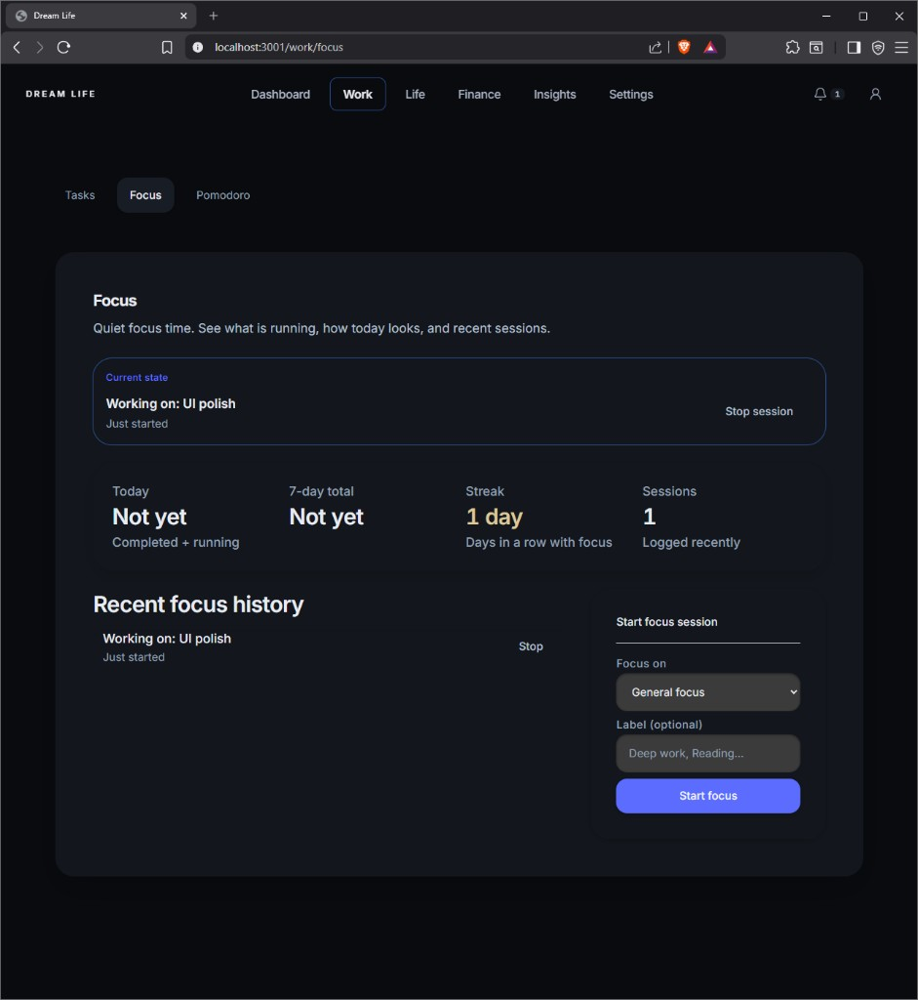
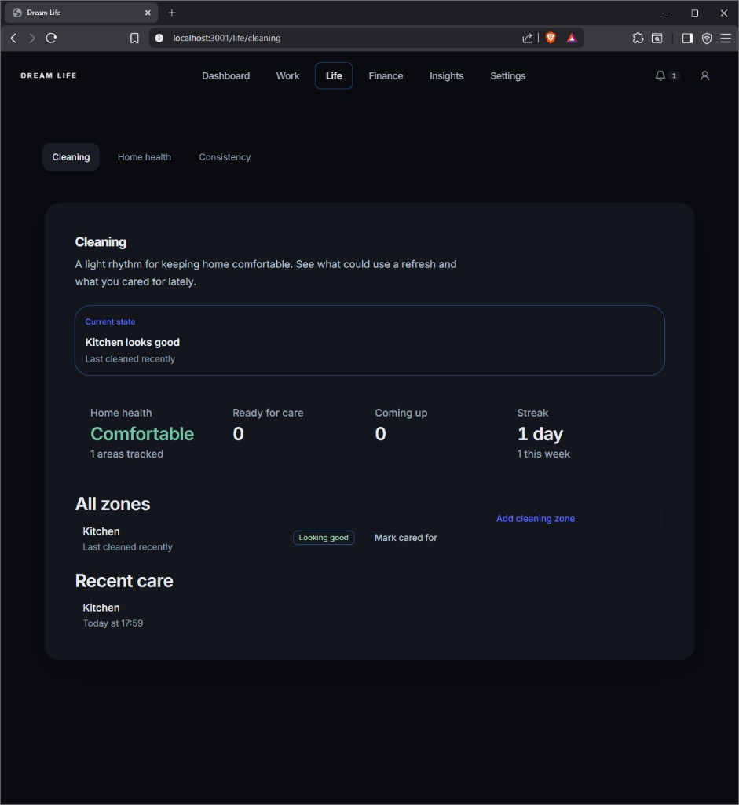
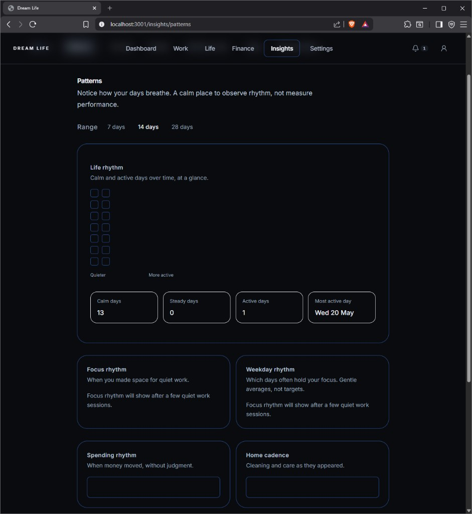
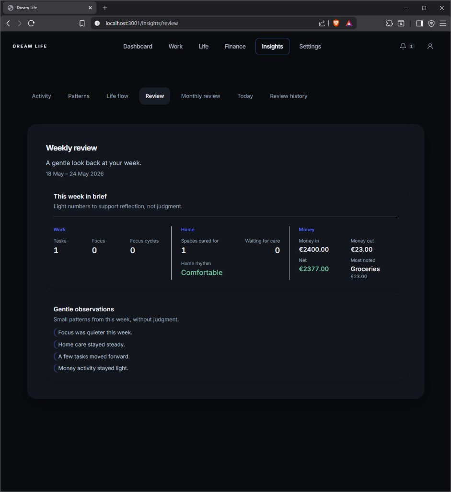

# Dream Life

A calm personal system for building the life you want through small daily steps.

Dream Life connects work, focus, home routines, finances, reflections, and patterns in one product. The repository folder is named `Life OS`; the application brand is **Dream Life**.

## Demo

<video src="assets/demo/dream-life-demo.mp4" controls width="100%"></video>

[Watch demo video](assets/demo/dream-life-demo.mp4)

## Project overview

Dream Life brings together:

- daily planning and dashboard overview
- tasks and focus sessions
- Pomodoro timing
- home care and cleaning rhythm
- finance tracking
- life flow timeline
- patterns and reflections
- settings and personalization

Activity is stored as structured events in PostgreSQL. Reviews, patterns, and timelines are derived from that history instead of arbitrary scores.

## Why this project exists

Many tools push users toward constant output. Dream Life is built around calm progress and a long-term direction. The interface favors reflection, readable status, and small next steps rather than pressure or gamification.

## Key features

### Dashboard

Overview of the day, goals, daily plan, suggestions, and notifications. The command center surfaces what matters now without turning the home screen into a metrics wall.

### Work

Task list with priorities and completion flow. Focus sessions track quiet work time. Pomodoro supports timed cycles linked to the same activity model.

### Life

Cleaning zones with last-cared-for rhythm and home health summary. Consistency views show gentle streaks over recent days.

### Finance

Income and expense logging with category context. Spending appears in weekly and monthly reviews alongside work and home activity.

### Insights

Activity feed, pattern analytics, life flow stream, daily notes, weekly review, monthly review, and review history. Copy is written for observation, not performance ranking.

### Settings

Appearance (dark, light, match device), language (English, Russian, Finnish), personalization defaults, automation toggles, and a long-term direction layer. Developer tools include controlled data reset for demos.

### Theme and localization

Shared design tokens, theme presets, and an i18n foundation with section-based message catalogs for EN, RU, and FI.

## Screenshots

### Dashboard overview


### Focus system



### Home care



### Patterns



### Life flow


### Weekly review



## Tech stack

**Frontend**

- Next.js
- React
- TypeScript
- Tailwind CSS

**Backend**

- FastAPI
- PostgreSQL
- SQLAlchemy
- Alembic

**Architecture**

- REST API
- event-driven activity model
- analytics layer for patterns and operational metrics
- AI-ready review structure (rule-based default, OpenAI optional)
- reusable UI components and surfaces
- theme system (`data-theme`)
- i18n foundation (EN / RU / FI)

## Architecture overview

```
Browser (Next.js)
    → REST API (FastAPI)
    → PostgreSQL
    → Events (tasks, focus, finance, cleaning, and related types)
    → Analytics and aggregations
    → Insights, reviews, and dashboard UI
```

The frontend loads data through the API and refreshes on server-sent events when activity changes. Preferences, theme, and locale are stored in the browser. Core domain data lives in the database.

## Local setup

### Prerequisites

- Docker (for PostgreSQL)
- Python 3.11+
- Node.js 18+

### Database

From the repository root:

```bash
docker compose up -d
```

PostgreSQL listens on host port **5433** by default.

### Backend

```bash
cd backend
python -m venv .venv
```

Activate the virtual environment, then:

```bash
pip install -r requirements.txt
cp .env.example .env
```

On Windows:

```text
copy .env.example .env
```

Run migrations and start the API:

```bash
python -m alembic upgrade head
python -m uvicorn app.main:app --reload --host 0.0.0.0 --port 8765
```

- API docs: http://127.0.0.1:8765/docs
- Health: http://127.0.0.1:8765/health

**Environment variables** (`backend/.env`):

| Variable | Purpose |
|----------|---------|
| `DATABASE_URL` | PostgreSQL connection string |
| `AI_PROVIDER` | `rule_based` (default) or `openai` |
| `OPENAI_API_KEY` | Required when using OpenAI |
| `OPENAI_MODEL` | Optional model name |

### Frontend

```bash
cd frontend
npm install
npm run dev
```

Open http://localhost:3001

The dev server proxies `/life-os-api` to the backend on port `8765`. To point at another API:

```powershell
$env:NEXT_PUBLIC_API_URL = "http://127.0.0.1:8765"
```

Restart `npm run dev` after changing `NEXT_PUBLIC_*` variables.

### Tests

```bash
cd backend
pytest
```

### Reset demo data

Settings → Developer tools → **Clear app history** (activity only) or **Reset all data** (includes goals, tasks, and cleaning zones). Theme, language, and preferences remain.

## Current status

Dream Life is an active MVP and portfolio project. Core flows work end to end: logging activity, viewing insights, managing tasks and focus, and running reviews. Localization and mobile layout are still expanding.

## Roadmap

- complete localization across English, Russian, and Finnish
- improve mobile responsive layout
- PWA support
- stronger automated test coverage
- optional IoT integration later
- richer AI-assisted reflections

## Portfolio value

This project demonstrates:

- full-stack development with a typed frontend and Python API
- product thinking across multiple life domains in one coherent app
- UI and UX system design with consistent tokens and calm copy
- event-driven architecture for activity and insights
- relational data modeling for tasks, finance, cleaning, goals, and reviews
- intentional product tone (reflection over pressure)
- AI-ready structure for daily and monthly reviews without requiring AI in production

## Repository layout

```
Life OS/
├── frontend/          # Next.js application
├── backend/           # FastAPI, Alembic, tests
├── assets/
│   ├── demo/          # Demo video
│   └── screenshots/   # README images
└── docker-compose.yml
```

## License

No license file is included yet. Add one before public distribution or forks.
